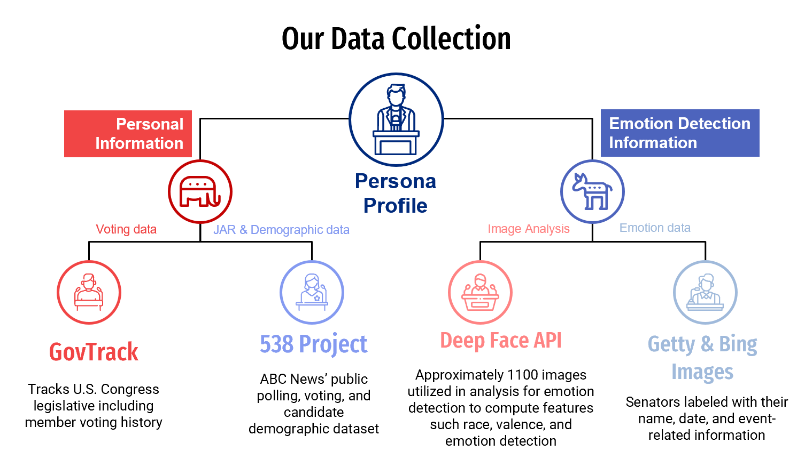

# I Approve this message: Examining the personified characteristics of U.S. Senators to predict job approval ratings​
UMBC Spring 2024 - DATA606 Data Science Capstone
Team 2: Saikumar Baddam, Elizabeth Cardosa, Ebony Cross-Williams

## Project Introduction
* In the "I Approve this message" project, we delve into the intricate world of U.S. Senators' job approval ratings (JARs). This project explores various factors influencing these ratings, including personal characteristics, legislative behavior, public sentiment, and emotional profiles derived from facial analysis. By constructing predictive models and analyzing feature importance, our goal is to unravel the complexities of senator approval ratings.

## Background 
* Navigating the U.S. political landscape is complex task, especially when attempting to decipher the factors contributing to a politician's success. Our project focuses on the public persona of senators and its profound impact on public opinion. Recognizing the pivotal role emotions play in political communication and leadership, we leverage facial emotion analysis to gain invaluable insights into these dynamics.

## Datasets
To construct a holistic understanding of each senator, we utilize three primary datasets:

### Senator Demographic and Polling Data: 
This dataset, sourced from the 538 Project and ABC News, encompasses senator demographics (age, gender, race, etc.), voting history, and approval rating percentages.
### Legislative Activity Data: 
Acquired from GovTrack and Congress.gov, this dataset furnishes information on bills introduced, co-sponsored, and voting behavior metrics such as ideology and leadership scores. These metrics shed light on a senator's political leanings and legislative influence.
### Senator Image Dataset: 
Comprising over 1100 facial images of senators obtained using the Bing API and other sources, this dataset captures diverse expressions and emotions, enabling deeper analysis of their public persona.

Quantifying Emotions: Valence Metrics
### Valence (V): This metric directly subtracts the percentage of negative emotions (N) from the percentage of positive emotions (P).
* Formula: V = P - N

### Normalized Valence (NV): This metric divides the valence score by the sum of all emotion percentages, providing a value between -1 and 1.
* Formula: NV = V / (P + N + E), where E represents neutral emotions.

### Weighted Valence (Val1, Val2, Val3): These metrics incorporate weighted emotions, with different weights assigned to each emotion based on their perceived positivity or negativity.
* Formula: Val_i = Σ (w_j * e_j) / 100, where:

* Val_i is the weighted valence score for weight set i (i = 1, 2, 3).
* w_j is the weight assigned to emotion j in the weight set i.
* e_j is the percentage of emotion j detected in the facial expression.

The weight sets used in my project are as follows:

* weights_set1: { "happy": 0.4, "surprise": 0.3, "angry": -0.2, "sad": -0.1, "fear": -0.1, "disgust": -0.1, "neutral": 0.0 }

* weights_set2: { "happy": 0.3, "surprise": 0.2, "angry": -0.3, "sad": -0.2, "fear": -0.2, "disgust": -0.1, "neutral": 0.0 }

* weights_set3: { "happy": 0.5, "surprise": 0.2, "angry": -0.1, "sad": -0.3, "fear": -0.1, "disgust": -0.1, "neutral": 0.0 }

### Weighted Valence Mean (WVM): This metric averages the three weighted valence scores for a balanced perspective.

* Formula: WVM = (Val1 + Val2 + Val3) / 3

## Final Features and Target Variable
### Features: 
The final feature set used for model training encompasses demographic information, legislative activity metrics, and emotional profile features, providing a comprehensive view of each senator's background, behavior, and public image.
### Target Variable: The senator's Job Approval Rating (JAR) serves as the target variable, reflecting public opinion on their performance.

Correlation Analysis: 

## Models
We explored a range of machine learning and deep learning models to predict senator JARs:
### Traditional Models: 
* We implemented and evaluated models such as Linear Regression, K-Nearest Neighbors, Decision Tree, Random Forest Regressor, XGBoost, and CatBoost (with and without pre-processing) to establish baseline performance and compare with deep learning approaches.
### Deep Learning Models:
* We explored Artificial Neural Networks (ANNs) with different activation functions (ReLU) and optimizers (AdamR, AdamW, Adam, Adamax), as well as Recurrent Neural Networks (RNNs) to capture potential temporal dependencies in the data.

| Metric | Decision Tree | CatBoost Regressor | ANN (ReLu) |
| --- | --- | --- | --- |
| Train MSE | 21.69 | 12.61 | 16.40 |  
| Train MAE | 3.35 | 2.58 | 2.90 | 
| Train R2 | 0.56 | 0.75 | 0.69 |
| Test MSE | 24.57 | 17.71 | 22.44 |
| Test MAE | 3.59 | 3.08 | 3.44 |
| Test R2 | 0.60 | 0.74 | 0.578 | 

CatBoost Regressor Feature Importances: 

## Conclusions 
* Our analysis revealed that CatBoost with transformed features achieved the best performance in predicting senator JARs, demonstrating the highest R2 score and lowest errors. This model also requires fewer training resources and offers interpretable feature importances, making it a suitable choice for this task.

* Obtained a good model for predicting Senator's Approval Ratings​
  * Can be used for campaign and election planning​
  * Can be used to glean insights into Senator's performance at any point in cycle​

* Identified key factors for Senator's Job Approval Ratings​
  * The Stage of the election – particularly if in Jungle Primary​
    * "Majority-vote primary paired with a plurality-vote general election"​
  * Ideology – A function of party and voting patterns​
    * Somewhat correlated with "bills-with-companion" and "cosponsored bills"​
  * Valence – A measure of emotional profile

# Future Work: 

## Target User(s)
* Senators/Campaign managers​
  * Identify performance at a given point in time to influence voting decisions, public persona, and engagement​

* Tailor campaign strategies based on predicted approval ratings​
  * Use localized feature importances to understand impacts of demographic and voting behavior on job approval rating​
  
* Voters​
  * Model Senators approval ratings in the future to help identify optimal candidate to vote for

## Deployment 
* User Interface – Intuitive way to interact with and glean insights from model inferences​
  * Visualizations​ 
  * Explanations​
  * App that allows a Senator to use their device camera in real-time or uplaod photos to analyze their emotion and "persona" to predict their JAR 

* Model Retraining - Whenever new polling data comes out retrain model with updated data set​
  * Scheduled vs. Automatic based on available data​
  * Complete retraining vs. Fine-tuning​
  
* DevOps/MLOps – Establish infrastructure to automatically deploy and update project​
  * Continuous model integration​
  * Monitoring of model performance 

## Additional Analysis: 
* Train project-specific emotion classifier/valence regressor
  * Use the EMOTIC dataset to train a model specifically built with a subset of emotions to best represent a politician's "persona" 

* Curate more data
  * Gather more senator images
  * Obtain JARs over longer period of time, representing more senators as well

* World Events effects on JARs
  * Perform analysis of global events, such as COVID-19, wars, economic crisis on JARs and if there are any trends that arrise that could be used to predict future JARs during world events.

* Clustering Analysis
  * Perform clustering to see if natural trends arise in the senator datasets such as relationships between demographic data, persona characeteristics, party, etc. 

# Repository How-to Guide
## data 
* Data Collection
  * Four main data sources were used to create each Senator's "persona profile":
    1) Voting Data: Source -> GovTrack.us, Tracks U.S. Congress legislative information including member voting history
    2) JAR & Demographic data: Source -> 538 Project, ABC News' public polling, voting, and candidate demographic dataset
    3) Image Analysis: Source -> Deep Face API, using nearly 1100 gathered images, the Deep Face API was used to compute valence, race, and emotion through face detection algorithms
    4) Image Data: multiple images were gather for each Senator to further used in the image analysis 

* Curated Personal Profile
  * Execute both the cleaning and EDA notebooks listed below to create the senator "persona profile" data object

 

## notebooks 
1) [Clean Data: Part 1](notebooks/final_notebooks/book1_clean_merge_senator_votes.ipynb)
2) [Cleaning Data: Part 2](notebooks/final_notebooks/book2_clean_merge_senator_plusvote_data.ipynb)
3) Image Analysis
4) [EDA & Traditional Modeling](notebooks/final_notebooks/book4_final_eda_tradition_modeling.ipynb)
5) [Deep Learning Modeling](notebooks/final_notebooks/book5_DLmodeling.ipynb)

All csv files needed to run files are embedded into the notebooks via public urls. Thus, notebooks can run as they stand without having to upload additional files.

## team_csv_code
* development team csv files: [development csv files](team_csv_code/dev_csv_code)
* Main csv file: [Main csv file](team_csv_code/dev_csv_code)

* To properly run both the traditional and deep learning modeling notebooks, the [Main csv file](team_csv_code/dev_csv_code) is required. Note: this required file is already embedded into the specific notebooks. Thus, otebooks can run as they stand without having to upload additional files.
